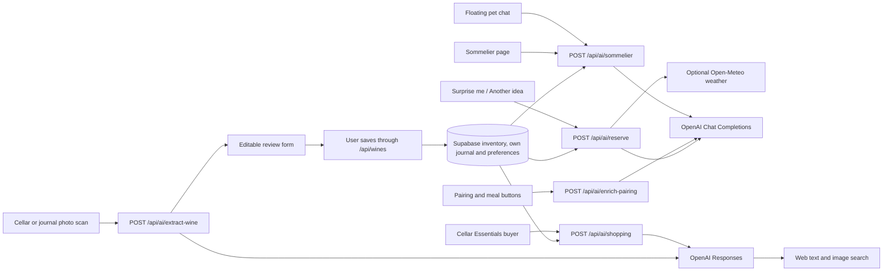

# Flint: AI integrations and API map

Reviewed: **2026-10-01**. This describes the current repository, not a verified Vercel deployment. Model names below are the defaults/configuration in code; this audit did not make paid provider calls or verify account access to those models.

## 1. Overview

Flint has **five AI endpoints**, all implemented as Next.js server routes calling OpenAI with `fetch`. Two interfaces share the sommelier endpoint, two share label scanning, and two forms expose pairing/meal buttons. There is no separate hosted agent, vector database, fine-tuned model, or model-managed persistent memory. Explicit personal preferences now persist in Supabase, with fresh journal-derived evidence.

| User-facing feature | Entry point | Internal call | Model configured in code | External API | Web research? |
| --- | --- | --- | --- | --- | --- |
| Floating sommelier | Main cellar → click the pet → send a message | `POST /api/ai/sommelier` | `gpt-6-luna` | OpenAI Chat Completions | No |
| Full sommelier page | `/sommelier` → send a message | Same endpoint | `gpt-6-luna` | OpenAI Chat Completions | No |
| Add wine by photo | Main cellar → Add a wine → scan | `POST /api/ai/extract-wine` | `gpt-6-luna` | OpenAI Responses | Text and image search tools |
| Add external wine by photo | Journal → add external wine → scan | Same endpoint | Same scan model | OpenAI Responses | Text and image search tools |
| Improve Food Pairing Notes / suggest another meal | Scan review in the cellar, or Edit wine in cellar/journal | `POST /api/ai/enrich-pairing` | `gpt-6-luna` | OpenAI Chat Completions | No |
| Cellar Essentials shopping | `/cellar-essentials` → Shopping list → send a request | `POST /api/ai/shopping` | `gpt-6-luna` | OpenAI Responses | Web search, retrieved URLs and citations |
| Personalized evening | Main cellar → Surprise me / Another idea · AI | `POST /api/ai/reserve` | `gpt-6-luna` | OpenAI Chat Completions | No |

External OpenAI URLs used by the code:

- `https://api.openai.com/v1/chat/completions`
- `https://api.openai.com/v1/responses`

All AI calls are initiated by a user action. Opening the pet, viewing a page, setting the scene, selecting an occasion, or revealing a conversation question does not itself make an AI request. “Surprise me” and “Another idea · AI” each request a fresh plan. One chat message, scan, pairing/meal click, or plan submission makes one application-level OpenAI request; scanning and the cellar buyer can additionally invoke provider-managed web tools within that request.

The AI routes produce suggestions or draft fields. They do not add, consume, delete, or modify wines in Supabase themselves.

## 2. Sommelier chat

**Callers:** `components/SommelierWidget.tsx` and `app/sommelier/page.tsx`.
**Route:** `app/api/ai/sommelier/route.ts`.
**Shared context/prompt/provider:** `lib/ai/cellar-context.ts`, `lib/ai/personal-sommelier.ts`.

Both chat interfaces now fetch authorized stock, the acting user's journal, and
per-user preferences on the server. The browser sends bounded user turns plus
the last discussed wine ID; it no longer supplies inventory or resends generated
assistant prose. The server rejects privileged message roles, checks origin and
cellar access, validates positive stock and returned wine/evidence IDs, and ranks
the model's suitable suggestions by estimated maturity. Follow-up answers use
the same formatter in both interfaces.

**Personalization:** `/my-palate` stores editable preferences and journal-learning
controls. Patterns use own personal scores and existing Cellar Essentials rules;
single observations are tentative. Opt-out/dismissal removes learning evidence.
The profile is account-wide, while journal evidence is selected-cellar scoped.
No other participant's ratings or comments are provided. Prices, private wine
notes, people and locations are excluded from model context. User-authored notes
and conversation may themselves contain personal information.

**Configuration:** `gpt-6-luna`; reasoning effort `none`; temperature 0.4; strict JSON schema;
`max_completion_tokens: 2200`; 22-second provider timeout; 30-second route duration;
`store:false`. The UI sends up to 12 recent user messages. Candidate/review
context is capped at 80 each. No shared conversation persistence or live shopping
research. See [My palate](my-palate.md) for exact ranking, exclusions and limits.

## 3. Wine identification and web images

**Callers:** `components/AIWineModal.tsx`, `components/AIExternalWineModal.tsx`, shared `hooks/useWineScan.ts`.
**Route:** `app/api/ai/extract-wine/route.ts`.
**Model, prompt, schema and provider parsing:** `lib/ai/wine-extraction.ts`.
**Image preparation:** `utils/prepareWinePhoto.ts`.
**Review display:** `components/WineScanReview.tsx`.

### Data path

1. The user selects a JPG, PNG or WebP, up to 10 MB. The browser redraws it as a JPEG, at most 1600 pixels on its longest side, stripping the original metadata.
2. It sends `{ image: <base64 JPEG>, locale }`. No cellar inventory or journal is included in the model request.
3. The server checks origin and cellar membership, bounds the request to 4 MiB, then calls Responses with the photo, identification instructions and required web search.
4. The prompt asks for exact producer/cuvée/vintage identification; origin, style and grapes; maturity estimates; pairings; one meal; a bottle image; a technical sheet; and uncertainty warnings. It forbids guessed vintages, prices, critic scores, IDs and stock/journal assignments.
5. Web tools may retrieve text and images. The application accepts a bottle-image URL only if it occurs in an actual `image_result` with a source page. Technical-sheet URLs must occur among retrieved sources/citations. Matching the exact wine/vintage still involves model judgement and user review; URL provenance alone does not establish correctness or future image availability.
6. The review form shows the web image and source, with a different/unspecified-vintage warning when applicable. Missing images stay empty; the uploaded identification photo is never saved as the bottle image.
7. Confirmed cellar additions go through `POST /api/wines`. External journal additions first open the tasting/participant dialog and are saved through the normal journal flow. IDs come from Postgres, not AI.

Unknown vintage is displayed blank and stored as the app's existing `0` unknown/NV value. Unknown peak year remains blank. Fresh scans clear the previous form, and cancellation prevents late research results from filling a reopened form.

**Configuration:** reasoning `low`; `max_output_tokens: 5000`; `max_tool_calls: 4`; image search requests up to 5 results; strict JSON schema; `store: false` explicitly sent. Server timeout 110 seconds, route duration 120 seconds, browser timeout 115 seconds. There is no application rate limit or automatic retry. `store: false` describes the request flag, not a guarantee about all provider retention policies.

The scanner no longer calls the previous optional Bing image/web search integration. The repository's scan tests use mocked OpenAI responses; they do not prove production model access or live search quality.

## 4. Pairing notes and meal suggestions

**Callers:** `components/AIWineModal.tsx:96` and `components/WineModal.tsx:100`.
**Route/prompt:** `app/api/ai/enrich-pairing/route.ts`.

- Input: one wine's name, country, region, vintage, style and grapes; current pairing text; current meal; mode (`pairing`, `meal`, or API-default `both`); locale.
- The prompt asks for concise pairing guidance, decanting advice, and one specific main dish. It refines current notes or avoids repeating the current meal.
- Output always contains `foodPairingNotes` and `mealToHaveWithThisWine`; the calling button applies its relevant field.
- Values stay in the editable form until the user saves the wine. Manual add forms do not call AI automatically; the external-photo review does not expose these enrichment buttons.
- Model `gpt-6-luna`, reasoning effort `none`, temperature `0.5`, JSON-object mode, `max_completion_tokens: 1200`, `store:false`, 22-second timeout. No web research or rate limit.
- Login middleware applies; the handler has no separate cellar-membership/origin check and accepts the wine description supplied by the browser.

The prompt forbids critic scores and claims of research because this feature has no verified rating sources. Pairing and decanting text remains model-generated guidance for review.

## 5. Contextual evening picks

**Caller:** `components/ReserveSpotlight.tsx`.
**Route:** `app/api/ai/reserve/route.ts`.
**Request/access handling:** `lib/ai/reserve-endpoint.ts`.
**Weather integration:** `lib/evening-weather.ts`.

The initial card is an invitation with no selected bottle. “Set the scene” opens
controls only; “Surprise me” and “Another idea · AI” each request a fresh AI pick.
There is no local recommendation fallback. The latter excludes the previous wine.

The server checks cellar membership, then loads fresh stock, own journal and My
palate preferences. The shared personal sommelier receives occasion, a 240-character
scene, local time and optional current weather. Food and explicit preferences take
precedence; estimated maturity is prioritized among suitable wines. Weather is a
soft cue, never a blanket exclusion for sparkling or another style.

Location is requested only after clicking to generate. GPS is rounded to one decimal
before transmission and again on the server. Open-Meteo gets approximate coordinates;
OpenAI gets a weather summary, time and optional selected city, never coordinates.
Users can explicitly select a city from `/api/weather/places` results or skip weather.
Denied/failed location or failed/stale weather continues with no weather assumptions,
and the result clearly labels the omission. Weather attribution is shown.

Cancellation propagates to weather and OpenAI requests. Timeouts: browser 50 seconds
(including up to 10 for geolocation), weather 8 seconds total, OpenAI 22 seconds,
route maximum 60 seconds. Best-effort per-user in-flight suppression and 1.5-second
post-request cooldown are per server instance. Plans and location choices stay only
in component memory. See [behavior, privacy and setup](evening-picks.md).

## 6. Cellar Essentials buyer

PDF support: **2026-10-08**. Private conversation history: **2026-10-09**.

**Caller:** `components/CellarEssentialsShopping.tsx`.
**Route:** `app/api/ai/shopping/route.ts`.
**Access/request handling:** `lib/ai/shopping-endpoint.ts`.
**Context, prompt and source validation:** `lib/ai/shopping-advisor.ts`.

The server verifies membership of the requested cellar before reading fresh stock,
permitted own-journal evidence and the authenticated user's preferences. Coverage
is calculated for all 39 Essentials. The conversation asks for a shopping market,
accepts budget/retailer constraints, and researches missing or restocking styles.
An empty cellar gets a small foundational selection rather than another account's
shopping list. Unknown blend composition requires review before buying.

Up to six product cards require actual completed web research, a retrieved source
URL, and a valid match to a current gap. Source presence establishes URL provenance;
exact product identity, vintage, price and availability still involve model judgment.
Cards display uncertainty, retailer links and a research timestamp. No LCBO inventory
API, purchase execution, separate wishlist or automatic inventory write is used.
The old curated file remains historical research and is not shown as a live shortlist.

The buyer also accepts one PDF wine list up to 3 MB. The browser sends its filename
and base64 contents only when the user sends a message, retaining it for follow-ups
until removed, replaced or the conversation is cleared. The server checks file
size/signature and passes it as a native Responses `input_file`, together with
fresh authorized cellar and palate context. PDF recommendations have filename/page
references and document prices, separate from live web products. They require a
valid cellar-gap match and respect explicit avoid preferences; page contents and
offer accuracy still depend on model interpretation. PDFs are not persisted in
Supabase or uploaded through the Files API. No additional key or SQL is needed.

Sent buyer conversations now persist in `buyer_conversations` and `buyer_turns`,
scoped to the current user and cellar. **Previous conversations** reopens a chat,
including historical product cards and PDF filename/page citations; PDF bytes
must be reattached. The server saves each question before requesting AI and saves
the answer before reporting success. Reopening does not call AI. Follow-ups use
fresh authorized context plus recent saved user questions and product references,
not prior assistant prose. Apply `20261009000000_buyer_conversations.sql` before
using the updated UI. No new environment variable is required.

Configuration: `gpt-6-luna`, Responses, reasoning `low`, strict JSON output,
`max_output_tokens: 5500`, `max_tool_calls: 6`, `store:false`; provider timeout
100 seconds, browser timeout 110 seconds, route maximum 120 seconds. At most 12
user turns, 120 descriptive stock labels and 30 eligible personal reviews are sent;
coverage itself uses all stock. Duplicate suppression is per server instance.
See [Cellar buyer](cellar-buyer.md) for setup, privacy and remaining validation.

## 7. Common behavior and remaining gaps

| Concern | Current implementation |
| --- | --- |
| Provider keys | Server-only `OPENAI_API_KEY` for all five routes |
| Model selection | All five endpoints use `AI_MODEL` (`gpt-6-luna`) in `lib/ai/models.ts`; no environment override |
| Streaming | None; browser waits for JSON |
| Fresh stock | Chat, planner and buyer read authorized server inventory |
| Journal/taste learning | Per-user preferences, own scores/comments and evidence-based patterns; migration required |
| Web research | Scanning and the cellar buyer use Responses web tools |
| Usage accounting | No shared request/cost telemetry |
| Rate limits | Planner cooldown and buyer duplicate suppression; no distributed limit |
| Error handling | All five routes keep provider error bodies out of browser responses |
| Writes | Separate user actions; recommendation calls never modify inventory |

Remaining work: evaluate live recommendation quality, improve maturity source
provenance and large-cellar retrieval, centralize operational controls, and evaluate live
purchase research and retailer freshness. The [longer-term plan](plans/cellar-aware-sommelier.md) records
those future phases; [My palate](my-palate.md) describes the implemented release.

## 8. Other website API calls (not AI)

All paths below are same-origin Next.js routes. Supabase SDK calls happen on the server using the authenticated session and database row-level security, except the specifically authorized admin invitation operation.

| API route | Methods used/implemented | Purpose / downstream operation |
| --- | --- | --- |
| `/api/auth/session` | GET | User and available/selected cellars from Supabase |
| `/api/auth/login` | POST | Supabase `signInWithPassword` |
| `/api/auth/logout` | POST | Supabase local-session `signOut` |
| `/api/auth/forgot-password` | POST | Supabase `resetPasswordForEmail` |
| `/api/auth/reset-password` | POST | Supabase `updateUser({ password })` after authentication |
| `/api/auth/cellar` | POST | Validate membership and change the selected-cellar cookie |
| `/auth/callback` | GET | Supabase `exchangeCodeForSession` or `verifyOtp`; auth redirect rather than an `/api` route |
| `/api/weather/places` | POST | Authenticated city search through Open-Meteo / GeoNames; returns explicit location choices |
| `/api/shopping/conversations` | GET | List only the user’s conversations in the selected cellar |
| `/api/shopping/conversations/[id]` | GET, PATCH | Read paginated saved turns or rename an owned conversation |
| `/api/palate` | GET, PUT | Read derived personal profile; save only the authenticated user’s preferences |
| `/api/wines` | GET, POST | List inventory with journal data; insert cellar stock or call `log_consumed_wine` for a new journal wine |
| `/api/wines/[id]` | GET, PUT, DELETE | Read, edit or delete a wine within an authorized cellar |
| `/api/wines/[id]/consume` | POST | `consume_wine` transaction: stock, tasting participants and optional personal review |
| `/api/wines/[id]/review` | PUT | Validate participation and upsert the user's `wine_reviews` entry |
| `/api/wines/[id]/participants` | POST | `add_wine_participants` for an existing tasting |
| `/api/cellar/people` | GET, POST | Read roster/role; `save_cellar_person`; optionally Supabase Auth `inviteUserByEmail` using the server admin key |
| `/api/cellar/storage` | GET, POST, DELETE | Read fridges/locations; `save_cellar_fridge` or `delete_cellar_fridge` |
| `/api/wine-trivia` | GET | Read and shuffle repository JSON questions; no provider generation |
| `/api/pin` | POST, retired | Returns HTTP 410; email/password replaced PIN login |

Main callers: `hooks/useWineInventory.ts`, `components/CellarSession.tsx`, `components/AuthForm.tsx`, `app/sommelier/page.tsx`, `app/cellar-essentials/page.tsx`, `app/wine-map/page.tsx`, and `app/wine-trivia/page.tsx`.

Supabase tables involved: `cellars`, `cellar_members`, `wines`, `cellar_people`, `wine_participants`, `wine_reviews`, `cellar_fridges`, `cellar_storage_locations`, `palate_preferences`, `buyer_conversations`, `buyer_turns`, plus Supabase Auth. The middleware also calls `auth.getUser()` to authenticate protected page/API requests; handlers may perform their own user/membership checks too.

### Other external network dependencies

- **Evening weather:** server-only Open-Meteo current weather and city search. No weather/location call on page load; GPS permission is requested only when a pick is requested in “Near me” mode. Optional `OPEN_METEO_API_KEY` switches to customer endpoints.

- **Wine map:** Leaflet requests OpenStreetMap standard tiles at `https://tile.openstreetmap.org/{z}/{x}/{y}.png`; markers use local CSS, with no external marker-image dependency. OpenStreetMap attribution is shown. No AI geocoding call is implemented. Country/region text resolves to approximate points locally; stock and personal journal entries share the map. See [location storage and map behavior](wine-map.md).
- **Bottle portraits:** browsers load saved image URLs from their remote hosts. Technical sheets and retailer/source links open their destinations when clicked.
- **Cellar Essentials shopping:** purchase options are generated per authorized cellar through Responses web search. Retailer/source links are opened only when clicked. `data/cellar-shopping.ts` preserves earlier historical research; it is no longer displayed as the shopping list. There is no direct LCBO stock/pricing API integration.
- **Badges:** local rules match personal journal entries to badge definitions; no AI or badge-award API call.
- **Sommelier artwork:** `/images/sommelier-cat.png` is a static asset. Dragging saves its position in browser local storage; no image-generation API runs in the website.
- **Vercel Analytics:** `app/layout.tsx` includes the analytics component. Its deployment-dependent network behavior was not measured by this code audit.
- **Fonts:** `next/font/google` configures Inter; separate from AI features.

## 9. Configuration and change locations

| Variable | Purpose |
| --- | --- |
| `OPENAI_API_KEY` | Required by all AI routes; server-only |
| `OPEN_METEO_API_KEY` | Optional commercial Open-Meteo key; server-only; omit for personal non-commercial use |
| `NEXT_PUBLIC_SUPABASE_URL` | Supabase project URL |
| `NEXT_PUBLIC_SUPABASE_PUBLISHABLE_KEY` | Public Supabase key; legacy `NEXT_PUBLIC_SUPABASE_ANON_KEY` also supported |
| `SUPABASE_SECRET_KEY` | Optional server-only account-invitation key; legacy `SUPABASE_SERVICE_ROLE_KEY` also supported |
| `NEXT_PUBLIC_SITE_URL` | Deployed origin for recovery and invitation redirects |

Model/prompt files: `lib/ai/personal-sommelier.ts`, `lib/ai/cellar-context.ts`, `app/api/ai/enrich-pairing/route.ts`, `lib/ai/wine-extraction.ts`, and `lib/ai/shopping-advisor.ts`. All features import the model from `lib/ai/models.ts`. The former `OPENAI_WINE_MODEL` override is no longer read and can be removed from Vercel. Chat, pairing and the planner explicitly use reasoning effort `none` to preserve their previous interactive behavior; scanning and shopping use Responses reasoning `low` and research tools. Chat requests use `max_completion_tokens`, not deprecated `max_tokens`. There is no shared prompt registry.

Audit method: traced every `/api/ai` caller and provider URL, enumerated route handlers and Supabase operations, and checked client persistence/confirmation behavior. This map reflects the personal-palate and cellar-buyer implementations; live provider behavior remains unverified. Deployment settings, provider availability, actual costs/latencies, and production traffic were not inspected.

Model migration references: [GPT-6 Luna](https://developers.openai.com/api/docs/models/gpt-6-luna), [model parameter guidance](https://developers.openai.com/api/docs/guides/latest-model), [Chat Completions parameters](https://developers.openai.com/api/reference/resources/chat/subresources/completions/methods/create).
