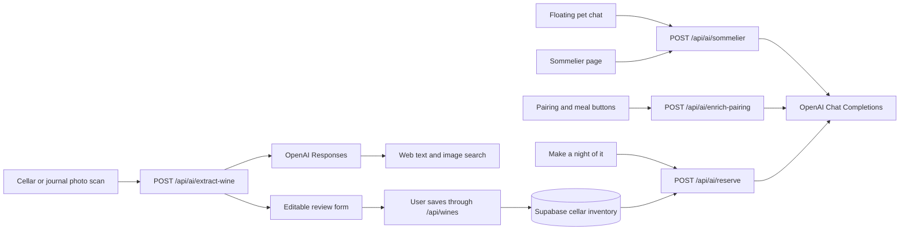

# Flint: AI integrations and API map

Reviewed: **2026-09-26**. This describes the current repository, not a verified Vercel deployment. Model names below are the defaults/configuration in code; this audit did not make paid provider calls or verify account access to those models.

## 1. Overview

Flint has **four AI endpoints**, all implemented as Next.js server routes calling OpenAI with `fetch`. Two interfaces share the sommelier endpoint, two share label scanning, and two forms expose pairing/meal buttons. There is no separate hosted agent, vector database, fine-tuned model, or shared persistent AI memory in the current implementation.

| User-facing feature | Entry point | Internal call | Model configured in code | External API | Web research? |
| --- | --- | --- | --- | --- | --- |
| Floating sommelier | Main cellar → click the pet → send a message | `POST /api/ai/sommelier` | `gpt-4o-mini` | OpenAI Chat Completions | No |
| Full sommelier page | `/sommelier` → send a message | Same endpoint | `gpt-4o-mini` | OpenAI Chat Completions | No |
| Add wine by photo | Main cellar → Add a wine → scan | `POST /api/ai/extract-wine` | `OPENAI_WINE_MODEL`, default `gpt-6-luna` | OpenAI Responses | Text and image search tools |
| Add external wine by photo | Journal → add external wine → scan | Same endpoint | Same scan model | OpenAI Responses | Text and image search tools |
| Improve Food Pairing Notes / suggest another meal | Scan review in the cellar, or Edit wine in cellar/journal | `POST /api/ai/enrich-pairing` | `gpt-4o-mini` | OpenAI Chat Completions | No |
| Personalized evening | “Tonight, perhaps…” → Set the mood → Make a night of it | `POST /api/ai/reserve` | `gpt-4o-mini` | OpenAI Chat Completions | No |

External OpenAI URLs used by the code:

- `https://api.openai.com/v1/chat/completions`
- `https://api.openai.com/v1/responses`

All AI calls are initiated by a user action. Opening the pet, viewing a page, selecting an occasion, shuffling bottles, or revealing a conversation question does not itself make an AI request. One chat message, scan, pairing/meal click, or personalized-plan submission makes one application-level OpenAI request; a scan can additionally invoke provider-managed web tools within that request.

The AI routes produce suggestions or draft fields. They do not add, consume, delete, or modify wines in Supabase themselves.

## 2. Sommelier chat

**Callers:** `components/SommelierWidget.tsx:69` and `app/sommelier/page.tsx:56`.
**Prompt, projection, maturity logic and provider call:** `app/api/ai/sommelier/route.ts`.

### Data path

1. The browser obtains wines from the authenticated `/api/wines` endpoint. The floating widget receives active wines from `CellarCollection`; the full page fetches the cellar's wine records itself.
2. Each message sends `{ wines, messages, locale }` to the sommelier route. `messages` contains the current component's entire conversation, including the newly entered message.
3. The route filters by `status === 'in_cellar'` (a missing status defaults to `in_cellar`). It does **not** check positive quantity or reload the wine list from Supabase.
4. OpenAI receives a reduced list containing ID, bottle name, country, region, vintage, style, grapes, pairing notes, suggested meal, drinking window, peak year, computed maturity status and ordinary wine notes, plus conversation text.
5. The response can be a clarification, recommendation, or follow-up answer. Recommendations contain a wine ID/name, reason, serving temperature, decanting guidance, and optional alternative IDs.
6. The browser looks up shelf location, image and alternative names in its inventory and formats the reply.

**Maturity prompting:** numeric `peakYear` compared with the current year produces past/at/near peak or “years until peak.” The prompt prioritizes past/at peak, then near peak. This is prompt guidance, not a server-enforced candidate ranking. The drinking window is sent as text but does not drive this route's maturity calculation. Values such as `2040+` or `Past peak` do not become numeric peaks here. There is no live weather lookup or seasonal calendar input beyond what the user says and the current year.

**Personalization:** personal journal scores/comments, inferred taste preferences, and critic scores are not included in the model's inventory projection. Consumed wines are filtered out. Preferences can influence the current conversation if the user states them there; they are not saved as a profile.

**Memory and privacy:** chat lives in React state, not a conversation table or provider thread. The widget and full-page chat do not share history. The server resends all supplied conversation text. Although shelf locations are excluded from the initial inventory projection, formatted assistant replies include them and those replies are sent back in later messages. User-entered messages can also contain personal information.

**Configuration:** temperature `0.4`; JSON-object mode, without strict field/ID validation; no explicit output-token cap, request timeout, history cap, or application rate limit. All routes are protected by login middleware, but this handler does not additionally call `requireCellar` or `checkOrigin`.

## 3. Wine identification and web images

**Callers:** `components/AIWineModal.tsx`, `components/AIExternalWineModal.tsx`, shared `hooks/useWineScan.ts`.
**Route:** `app/api/ai/extract-wine/route.ts`.
**Model, prompt, schema and provider parsing:** `lib/ai/wine-extraction.ts`.
**Image preparation:** `utils/prepareWinePhoto.ts`.
**Review display:** `components/WineScanReview.tsx`.

### Data path

1. The user selects a JPG, PNG or WebP, up to 10 MB. The browser redraws it as a JPEG, at most 1600 pixels on its longest side, stripping the original metadata.
2. It sends `{ image: <base64 JPEG>, locale }`. No cellar inventory or journal is included in the model request.
3. The server checks origin and cellar membership, bounds the request to 4 MiB, then calls Responses with the photo, identification instructions and required web search.
4. The prompt asks for exact producer/cuvée/vintage identification; origin, style and grapes; maturity estimates; pairings; one meal; a bottle image; a technical sheet; and uncertainty warnings. It forbids guessed vintages, prices, critic scores, IDs and stock/journal assignments.
5. Web tools may retrieve text and images. The application accepts a bottle-image URL only if it occurs in an actual `image_result` with a source page. Technical-sheet URLs must occur among retrieved sources/citations. Matching the exact wine/vintage still involves model judgement and user review; URL provenance alone does not establish correctness or future image availability.
6. The review form shows the web image and source, with a different/unspecified-vintage warning when applicable. Missing images stay empty; the uploaded identification photo is never saved as the bottle image.
7. Confirmed cellar additions go through `POST /api/wines`. External journal additions first open the tasting/participant dialog and are saved through the normal journal flow. IDs come from Postgres, not AI.

Unknown vintage is displayed blank and stored as the app's existing `0` unknown/NV value. Unknown peak year remains blank. Fresh scans clear the previous form, and cancellation prevents late research results from filling a reopened form.

**Configuration:** reasoning `low`; `max_output_tokens: 5000`; `max_tool_calls: 4`; image search requests up to 5 results; strict JSON schema; `store: false` explicitly sent. Server timeout 110 seconds, route duration 120 seconds, browser timeout 115 seconds. There is no application rate limit or automatic retry. `store: false` describes the request flag, not a guarantee about all provider retention policies.

The scanner no longer calls the previous optional Bing image/web search integration. The repository's scan tests use mocked OpenAI responses; they do not prove production model access or live search quality.

## 4. Pairing notes and meal suggestions

**Callers:** `components/AIWineModal.tsx:96` and `components/WineModal.tsx:100`.
**Route/prompt:** `app/api/ai/enrich-pairing/route.ts`.

- Input: one wine's name, country, region, vintage, style and grapes; current pairing text; current meal; mode (`pairing`, `meal`, or API-default `both`); locale.
- The prompt asks for concise pairing guidance, decanting advice, and one specific main dish. It refines current notes or avoids repeating the current meal.
- Output always contains `foodPairingNotes` and `mealToHaveWithThisWine`; the calling button applies its relevant field.
- Values stay in the editable form until the user saves the wine. Manual add forms do not call AI automatically; the external-photo review does not expose these enrichment buttons.
- Model `gpt-4o-mini`, temperature `0.5`, JSON-object mode. No web research, explicit token cap, timeout or rate limit.
- Login middleware applies; the handler has no separate cellar-membership/origin check and accepts the wine description supplied by the browser.

**Accuracy issue:** the prompt asks for critic initials and scores “if known,” but supplies neither verified ratings nor a research tool. It can therefore introduce an unsupported critic score into pairing text. This differs from the newer scanner, which explicitly forbids invented scores.

## 5. “Tonight, perhaps…” evening planner

**Caller:** `components/ReserveSpotlight.tsx:56`.
**Route/prompt:** `app/api/ai/reserve/route.ts`.
**Shared candidate selection and local fallback:** `utils/reserve.ts`; maturity helper `utils/cellar.ts:5`.

- Input: occasion, short scene (maximum 240 characters), cellar ID and locale. The browser does not supply the model's inventory.
- The route verifies membership, loads fresh cellar stock from Supabase, filters positive quantities, and selects up to 40 occasion candidates.
- Local ranking gives preference to readiness, sparkling wines for celebrations, larger quantities for company, and Coravin bottles for unwinding. Sweet/fortified styles are reserved for the dessert occasion.
- The model receives only candidate IDs/names, vintages, countries, regions, styles, grapes, pairing/meal descriptions and a drinking-window description. No journal reviews, personal wine notes, prices, people or shelf locations are projected.
- Output: a permitted wine ID, evening title, reason, meal and conversation question. Strict JSON schema restricts IDs to supplied candidates; the server and browser also validate the result.
- Model `gpt-4o-mini`, temperature `0.8`, maximum 600 output tokens; 18-second provider timeout; 30-second route duration; a best-effort 10-second per-user cooldown in server-instance memory.
- Closing/changing choices cancels the browser request. AI failure leaves the local recommendations usable. The request's cancellation signal is not forwarded to the provider call, which has its own timeout.

The initial card, occasion choices, shuffle, surprise reveal, meal fallback and conversation question work locally without an AI call. Only **Make a night of it** generates new content. Generated plans are component state, not stored recommendations.

## 6. Common behavior and observed gaps

| Concern | Current implementation |
| --- | --- |
| Provider keys | Server-only `OPENAI_API_KEY` for all four routes |
| Model selection | Three hard-coded `gpt-4o-mini` routes; scanning alone accepts `OPENAI_WINE_MODEL` |
| Streaming | None: browser waits for a completed JSON response |
| Fresh stock | Planner reads server-side; chat trusts its browser snapshot |
| Journal/taste learning | Not implemented in the model inputs |
| Web research | Only scanning; no live buying agent or technical-sheet retrieval for chat |
| Usage accounting | No shared AI request/usage/cost records or central monitoring wrapper found |
| Rate limits | Planner's in-memory cooldown only; not shared across server instances |
| Error handling | Scanner/planner return controlled errors; chat/pairing can include raw provider error bodies in `details` |
| Database writes | Separate user-confirmed wine/journal endpoints, not model tool calls |

### Findings to address in a later implementation

1. **Bring the two chat interfaces into agreement.** The floating widget handles `type: "answer"`; the full `/sommelier` page handles only `question` specially and otherwise formats a recommendation. A valid follow-up answer can render with undefined recommendation fields.
2. **Make chat recommendations depend on authenticated, current stock.** The chat route lacks positive-quantity filtering and does not validate returned recommendation IDs against allowed candidates. It also accepts browser-supplied message roles, including `system`.
3. **Unify maturity rules.** Chat derives status from a numeric peak; the planner ranks using `getMaturity`, which treats dates after a window's start as ready even after its end. The planner separately supplies an overdue-window warning. These paths can disagree and do not implement one shared “best estimated peak period” policy.
4. **Remove unsupported rating claims from pairing generation.** Pass verified critic data or omit critic scores from that prompt.
5. **Connect the personal journal deliberately.** A persistent taste profile and purchase recommendations remain future work; changing the model alone will not add them.
6. **Centralize operational controls.** A common model configuration, typed responses, payload/history limits, membership checks, timeouts, safe errors, and usage tracking would reduce drift between routes.

The agreed future direction is recorded in [the cellar-aware sommelier plan](/Users/elotfel/Documents/GitHub/flint/docs/plans/cellar-aware-sommelier.md). It remains a plan, separate from the implemented features above.

## 7. Other website API calls (not AI)

All paths below are same-origin Next.js routes. Supabase SDK calls happen on the server using the authenticated session and database row-level security, except the specifically authorized admin invitation operation.

| API route | Methods used/implemented | Purpose / downstream operation |
| --- | --- | --- |
| `/api/auth/session` | GET | User and available/selected cellars from Supabase |
| `/api/auth/login` | POST | Supabase `signInWithPassword` |
| `/api/auth/logout` | POST | Supabase local-session `signOut` |
| `/api/auth/forgot-password` | POST | Supabase `resetPasswordForEmail` |
| `/api/auth/reset-password` | POST | Supabase `updateUser({ password })` after authentication |
| `/api/auth/cellar` | POST | Validate membership and change the selected-cellar cookie |
| `/auth/callback` | GET | Supabase `exchangeCodeForSession` or `verifyOtp`; auth redirect rather than an `/api` route |
| `/api/wines` | GET, POST | List inventory with journal data; insert cellar stock or call `log_consumed_wine` for a new journal wine |
| `/api/wines/[id]` | GET, PUT, DELETE | Read, edit or delete a wine within an authorized cellar |
| `/api/wines/[id]/consume` | POST | `consume_wine` transaction: stock, tasting participants and optional personal review |
| `/api/wines/[id]/review` | PUT | Validate participation and upsert the user's `wine_reviews` entry |
| `/api/wines/[id]/participants` | POST | `add_wine_participants` for an existing tasting |
| `/api/cellar/people` | GET, POST | Read roster/role; `save_cellar_person`; optionally Supabase Auth `inviteUserByEmail` using the server admin key |
| `/api/cellar/storage` | GET, POST, DELETE | Read fridges/locations; `save_cellar_fridge` or `delete_cellar_fridge` |
| `/api/wine-trivia` | GET | Read and shuffle repository JSON questions; no provider generation |
| `/api/pin` | POST, retired | Returns HTTP 410; email/password replaced PIN login |

Main callers: `hooks/useWineInventory.ts`, `components/CellarSession.tsx`, `components/AuthForm.tsx`, `app/sommelier/page.tsx`, `app/cellar-essentials/page.tsx`, `app/wine-map/page.tsx`, and `app/wine-trivia/page.tsx`.

Supabase tables involved: `cellars`, `cellar_members`, `wines`, `cellar_people`, `wine_participants`, `wine_reviews`, `cellar_fridges`, `cellar_storage_locations`, plus Supabase Auth. The middleware also calls `auth.getUser()` to authenticate protected page/API requests; handlers may perform their own user/membership checks too.

### Other external network dependencies

- **Wine map:** Leaflet requests CARTO map tiles at `https://{s}.basemaps.cartocdn.com/...`; marker images come from `cdnjs.cloudflare.com`. OpenStreetMap attribution is shown. No AI geocoding call is implemented.
- **Bottle portraits:** browsers load saved image URLs from their remote hosts. Technical sheets and retailer/source links open their destinations when clicked.
- **Cellar Essentials shopping list:** curated products, prices, review dates and LCBO/Cellar Collection URLs live in `data/cellar-shopping.ts`. Coverage matching is local code using cellar/journal data. The website does not call a live LCBO stock/pricing API or generate a shopping list with AI at runtime.
- **Badges:** local rules match personal journal entries to badge definitions; no AI or badge-award API call.
- **Sommelier artwork:** `/images/sommelier-cat.png` is a static asset. Dragging saves its position in browser local storage; no image-generation API runs in the website.
- **Vercel Analytics:** `app/layout.tsx` includes the analytics component. Its deployment-dependent network behavior was not measured by this code audit.
- **Fonts:** `next/font/google` configures Inter; separate from AI features.

## 8. Configuration and change locations

| Variable | Purpose |
| --- | --- |
| `OPENAI_API_KEY` | Required by all AI routes; server-only |
| `OPENAI_WINE_MODEL` | Optional scanner model override; default `gpt-6-luna` |
| `NEXT_PUBLIC_SUPABASE_URL` | Supabase project URL |
| `NEXT_PUBLIC_SUPABASE_PUBLISHABLE_KEY` | Public Supabase key; legacy `NEXT_PUBLIC_SUPABASE_ANON_KEY` also supported |
| `SUPABASE_SECRET_KEY` | Optional server-only account-invitation key; legacy `SUPABASE_SERVICE_ROLE_KEY` also supported |
| `NEXT_PUBLIC_SITE_URL` | Deployed origin for recovery and invitation redirects |

Model/prompt files: `app/api/ai/sommelier/route.ts`, `app/api/ai/enrich-pairing/route.ts`, `app/api/ai/reserve/route.ts`, and `lib/ai/wine-extraction.ts`. There is currently no shared prompt registry or central model-selection file covering all four features.

Audit method: traced every `/api/ai` caller and provider URL, enumerated route handlers and Supabase operations, and checked client persistence/confirmation behavior. This document changes no runtime code. Deployment settings, provider availability, actual costs/latencies, and production traffic were not inspected.
