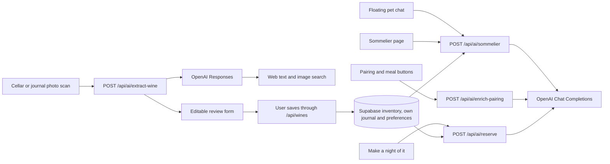

# Flint: AI integrations and API map

Reviewed: **2026-09-29**. This describes the current repository, not a verified Vercel deployment. Model names below are the defaults/configuration in code; this audit did not make paid provider calls or verify account access to those models.

## 1. Overview

Flint has **four AI endpoints**, all implemented as Next.js server routes calling OpenAI with `fetch`. Two interfaces share the sommelier endpoint, two share label scanning, and two forms expose pairing/meal buttons. There is no separate hosted agent, vector database, fine-tuned model, or model-managed persistent memory. Explicit personal preferences now persist in Supabase, with fresh journal-derived evidence.

| User-facing feature | Entry point | Internal call | Model configured in code | External API | Web research? |
| --- | --- | --- | --- | --- | --- |
| Floating sommelier | Main cellar → click the pet → send a message | `POST /api/ai/sommelier` | `gpt-6-luna` | OpenAI Chat Completions | No |
| Full sommelier page | `/sommelier` → send a message | Same endpoint | `gpt-6-luna` | OpenAI Chat Completions | No |
| Add wine by photo | Main cellar → Add a wine → scan | `POST /api/ai/extract-wine` | `gpt-6-luna` | OpenAI Responses | Text and image search tools |
| Add external wine by photo | Journal → add external wine → scan | Same endpoint | Same scan model | OpenAI Responses | Text and image search tools |
| Improve Food Pairing Notes / suggest another meal | Scan review in the cellar, or Edit wine in cellar/journal | `POST /api/ai/enrich-pairing` | `gpt-6-luna` | OpenAI Chat Completions | No |
| Personalized evening | “Tonight, perhaps…” → Set the mood → Make a night of it | `POST /api/ai/reserve` | `gpt-6-luna` | OpenAI Chat Completions | No |

External OpenAI URLs used by the code:

- `https://api.openai.com/v1/chat/completions`
- `https://api.openai.com/v1/responses`

All AI calls are initiated by a user action. Opening the pet, viewing a page, selecting an occasion, shuffling bottles, or revealing a conversation question does not itself make an AI request. One chat message, scan, pairing/meal click, or personalized-plan submission makes one application-level OpenAI request; a scan can additionally invoke provider-managed web tools within that request.

The AI routes produce suggestions or draft fields. They do not add, consume, delete, or modify wines in Supabase themselves.

## 2. Sommelier chat

**Callers:** `components/SommelierWidget.tsx` and `app/sommelier/page.tsx`.
**Route:** `app/api/ai/sommelier/route.ts`.
**Shared context/prompt/provider:** `lib/ai/cellar-context.ts`, `lib/ai/personal-sommelier.ts`.

Both chat interfaces now fetch authorized stock, the acting user's journal, and
per-user preferences on the server. The browser sends bounded user turns plus
the last discussed wine ID; it no longer supplies inventory or resends generated
assistant prose. The server rejects privileged message roles, checks origin and
cellar access, validates positive stock and returned wine/evidence IDs, and ranks
the model's suitable suggestions by estimated maturity. Follow-up answers use
the same formatter in both interfaces.

**Personalization:** `/my-palate` stores editable preferences and journal-learning
controls. Patterns use own personal scores and existing Cellar Essentials rules;
single observations are tentative. Opt-out/dismissal removes learning evidence.
The profile is account-wide, while journal evidence is selected-cellar scoped.
No other participant's ratings or comments are provided. Prices, private wine
notes, people and locations are excluded from model context. User-authored notes
and conversation may themselves contain personal information.

**Configuration:** `gpt-6-luna`; reasoning effort `none`; temperature 0.4; strict JSON schema;
`max_completion_tokens: 2200`; 22-second provider timeout; 30-second route duration;
`store:false`. The UI sends up to 12 recent user messages. Candidate/review
context is capped at 80 each. No shared conversation persistence or live shopping
research. See [My palate](my-palate.md) for exact ranking, exclusions and limits.

## 3. Wine identification and web images

**Callers:** `components/AIWineModal.tsx`, `components/AIExternalWineModal.tsx`, shared `hooks/useWineScan.ts`.
**Route:** `app/api/ai/extract-wine/route.ts`.
**Model, prompt, schema and provider parsing:** `lib/ai/wine-extraction.ts`.
**Image preparation:** `utils/prepareWinePhoto.ts`.
**Review display:** `components/WineScanReview.tsx`.

### Data path

1. The user selects a JPG, PNG or WebP, up to 10 MB. The browser redraws it as a JPEG, at most 1600 pixels on its longest side, stripping the original metadata.
2. It sends `{ image: <base64 JPEG>, locale }`. No cellar inventory or journal is included in the model request.
3. The server checks origin and cellar membership, bounds the request to 4 MiB, then calls Responses with the photo, identification instructions and required web search.
4. The prompt asks for exact producer/cuvée/vintage identification; origin, style and grapes; maturity estimates; pairings; one meal; a bottle image; a technical sheet; and uncertainty warnings. It forbids guessed vintages, prices, critic scores, IDs and stock/journal assignments.
5. Web tools may retrieve text and images. The application accepts a bottle-image URL only if it occurs in an actual `image_result` with a source page. Technical-sheet URLs must occur among retrieved sources/citations. Matching the exact wine/vintage still involves model judgement and user review; URL provenance alone does not establish correctness or future image availability.
6. The review form shows the web image and source, with a different/unspecified-vintage warning when applicable. Missing images stay empty; the uploaded identification photo is never saved as the bottle image.
7. Confirmed cellar additions go through `POST /api/wines`. External journal additions first open the tasting/participant dialog and are saved through the normal journal flow. IDs come from Postgres, not AI.

Unknown vintage is displayed blank and stored as the app's existing `0` unknown/NV value. Unknown peak year remains blank. Fresh scans clear the previous form, and cancellation prevents late research results from filling a reopened form.

**Configuration:** reasoning `low`; `max_output_tokens: 5000`; `max_tool_calls: 4`; image search requests up to 5 results; strict JSON schema; `store: false` explicitly sent. Server timeout 110 seconds, route duration 120 seconds, browser timeout 115 seconds. There is no application rate limit or automatic retry. `store: false` describes the request flag, not a guarantee about all provider retention policies.

The scanner no longer calls the previous optional Bing image/web search integration. The repository's scan tests use mocked OpenAI responses; they do not prove production model access or live search quality.

## 4. Pairing notes and meal suggestions

**Callers:** `components/AIWineModal.tsx:96` and `components/WineModal.tsx:100`.
**Route/prompt:** `app/api/ai/enrich-pairing/route.ts`.

- Input: one wine's name, country, region, vintage, style and grapes; current pairing text; current meal; mode (`pairing`, `meal`, or API-default `both`); locale.
- The prompt asks for concise pairing guidance, decanting advice, and one specific main dish. It refines current notes or avoids repeating the current meal.
- Output always contains `foodPairingNotes` and `mealToHaveWithThisWine`; the calling button applies its relevant field.
- Values stay in the editable form until the user saves the wine. Manual add forms do not call AI automatically; the external-photo review does not expose these enrichment buttons.
- Model `gpt-6-luna`, reasoning effort `none`, temperature `0.5`, JSON-object mode, `max_completion_tokens: 1200`, `store:false`, 22-second timeout. No web research or rate limit.
- Login middleware applies; the handler has no separate cellar-membership/origin check and accepts the wine description supplied by the browser.

The prompt forbids critic scores and claims of research because this feature has no verified rating sources. Pairing and decanting text remains model-generated guidance for review.

## 5. “Tonight, perhaps…” evening planner

**Caller:** `components/ReserveSpotlight.tsx`.
**Route:** `app/api/ai/reserve/route.ts`.

The AI planner shares the personal sommelier service above. It accepts an occasion,
scene (240 characters) and cellar ID, loads fresh authorized stock and own journal,
and applies existing occasion filters. Generated title, reason, meal, question and
journal citations are validated and shown in the dialog. Model settings match
chat. The existing best-effort 10-second per-user cooldown remains.

Initial card selection, occasion choices, shuffle, reveal, meal fallback and
conversation questions still work locally without AI. Only **Make a night of it**
uses personal context. Closing the dialog aborts the browser request; the provider
has its own timeout. Generated plans stay in component state.

## 6. Common behavior and remaining gaps

| Concern | Current implementation |
| --- | --- |
| Provider keys | Server-only `OPENAI_API_KEY` for all four routes |
| Model selection | All four endpoints use `AI_MODEL` (`gpt-6-luna`) in `lib/ai/models.ts`; no environment override |
| Streaming | None; browser waits for JSON |
| Fresh stock | Both chat and planner now read authorized server inventory |
| Journal/taste learning | Per-user preferences, own scores/comments and evidence-based patterns; migration required |
| Web research | Only scanning; buying agent remains future work |
| Usage accounting | No shared request/cost telemetry |
| Rate limits | Planner in-memory cooldown; no distributed limit |
| Error handling | All four routes keep provider error bodies out of browser responses |
| Writes | Separate user actions; recommendation calls never modify inventory |

Remaining work: evaluate live recommendation quality, improve maturity source
provenance and large-cellar retrieval, centralize operational controls, and implement sourced
purchase guidance. The [longer-term plan](plans/cellar-aware-sommelier.md) records
those future phases; [My palate](my-palate.md) describes the implemented release.

## 7. Other website API calls (not AI)

All paths below are same-origin Next.js routes. Supabase SDK calls happen on the server using the authenticated session and database row-level security, except the specifically authorized admin invitation operation.

| API route | Methods used/implemented | Purpose / downstream operation |
| --- | --- | --- |
| `/api/auth/session` | GET | User and available/selected cellars from Supabase |
| `/api/auth/login` | POST | Supabase `signInWithPassword` |
| `/api/auth/logout` | POST | Supabase local-session `signOut` |
| `/api/auth/forgot-password` | POST | Supabase `resetPasswordForEmail` |
| `/api/auth/reset-password` | POST | Supabase `updateUser({ password })` after authentication |
| `/api/auth/cellar` | POST | Validate membership and change the selected-cellar cookie |
| `/auth/callback` | GET | Supabase `exchangeCodeForSession` or `verifyOtp`; auth redirect rather than an `/api` route |
| `/api/palate` | GET, PUT | Read derived personal profile; save only the authenticated user’s preferences |
| `/api/wines` | GET, POST | List inventory with journal data; insert cellar stock or call `log_consumed_wine` for a new journal wine |
| `/api/wines/[id]` | GET, PUT, DELETE | Read, edit or delete a wine within an authorized cellar |
| `/api/wines/[id]/consume` | POST | `consume_wine` transaction: stock, tasting participants and optional personal review |
| `/api/wines/[id]/review` | PUT | Validate participation and upsert the user's `wine_reviews` entry |
| `/api/wines/[id]/participants` | POST | `add_wine_participants` for an existing tasting |
| `/api/cellar/people` | GET, POST | Read roster/role; `save_cellar_person`; optionally Supabase Auth `inviteUserByEmail` using the server admin key |
| `/api/cellar/storage` | GET, POST, DELETE | Read fridges/locations; `save_cellar_fridge` or `delete_cellar_fridge` |
| `/api/wine-trivia` | GET | Read and shuffle repository JSON questions; no provider generation |
| `/api/pin` | POST, retired | Returns HTTP 410; email/password replaced PIN login |

Main callers: `hooks/useWineInventory.ts`, `components/CellarSession.tsx`, `components/AuthForm.tsx`, `app/sommelier/page.tsx`, `app/cellar-essentials/page.tsx`, `app/wine-map/page.tsx`, and `app/wine-trivia/page.tsx`.

Supabase tables involved: `cellars`, `cellar_members`, `wines`, `cellar_people`, `wine_participants`, `wine_reviews`, `cellar_fridges`, `cellar_storage_locations`, `palate_preferences`, plus Supabase Auth. The middleware also calls `auth.getUser()` to authenticate protected page/API requests; handlers may perform their own user/membership checks too.

### Other external network dependencies

- **Wine map:** Leaflet requests CARTO map tiles at `https://{s}.basemaps.cartocdn.com/...`; marker images come from `cdnjs.cloudflare.com`. OpenStreetMap attribution is shown. No AI geocoding call is implemented.
- **Bottle portraits:** browsers load saved image URLs from their remote hosts. Technical sheets and retailer/source links open their destinations when clicked.
- **Cellar Essentials shopping list:** curated products, prices, review dates and LCBO/Cellar Collection URLs live in `data/cellar-shopping.ts`. Coverage matching is local code using cellar/journal data. The website does not call a live LCBO stock/pricing API or generate a shopping list with AI at runtime.
- **Badges:** local rules match personal journal entries to badge definitions; no AI or badge-award API call.
- **Sommelier artwork:** `/images/sommelier-cat.png` is a static asset. Dragging saves its position in browser local storage; no image-generation API runs in the website.
- **Vercel Analytics:** `app/layout.tsx` includes the analytics component. Its deployment-dependent network behavior was not measured by this code audit.
- **Fonts:** `next/font/google` configures Inter; separate from AI features.

## 8. Configuration and change locations

| Variable | Purpose |
| --- | --- |
| `OPENAI_API_KEY` | Required by all AI routes; server-only |
| `NEXT_PUBLIC_SUPABASE_URL` | Supabase project URL |
| `NEXT_PUBLIC_SUPABASE_PUBLISHABLE_KEY` | Public Supabase key; legacy `NEXT_PUBLIC_SUPABASE_ANON_KEY` also supported |
| `SUPABASE_SECRET_KEY` | Optional server-only account-invitation key; legacy `SUPABASE_SERVICE_ROLE_KEY` also supported |
| `NEXT_PUBLIC_SITE_URL` | Deployed origin for recovery and invitation redirects |

Model/prompt files: `lib/ai/personal-sommelier.ts`, `lib/ai/cellar-context.ts`, `app/api/ai/enrich-pairing/route.ts`, and `lib/ai/wine-extraction.ts`. All features import the model from `lib/ai/models.ts`. The former `OPENAI_WINE_MODEL` override is no longer read and can be removed from Vercel. Chat, pairing and the planner explicitly use reasoning effort `none` to preserve their previous interactive behavior; scanning retains Responses reasoning `low` and its research tools. Chat requests use `max_completion_tokens`, not deprecated `max_tokens`. There is no shared prompt registry.

Audit method: traced every `/api/ai` caller and provider URL, enumerated route handlers and Supabase operations, and checked client persistence/confirmation behavior. This map reflects the personal-palate implementation; live provider behavior remains unverified. Deployment settings, provider availability, actual costs/latencies, and production traffic were not inspected.

Model migration references: [GPT-6 Luna](https://developers.openai.com/api/docs/models/gpt-6-luna), [model parameter guidance](https://developers.openai.com/api/docs/guides/latest-model), [Chat Completions parameters](https://developers.openai.com/api/reference/resources/chat/subresources/completions/methods/create).
